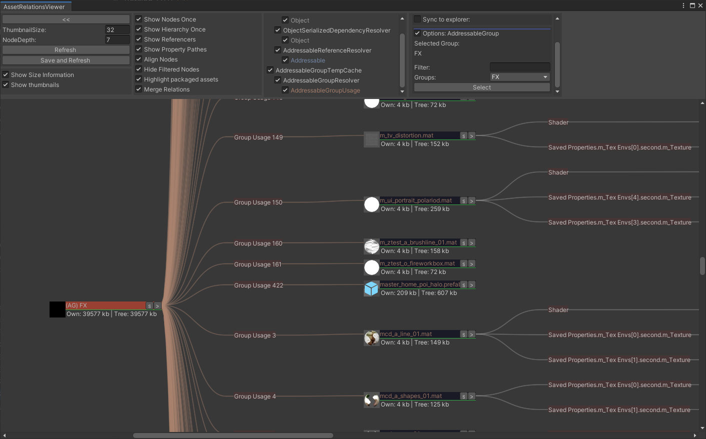
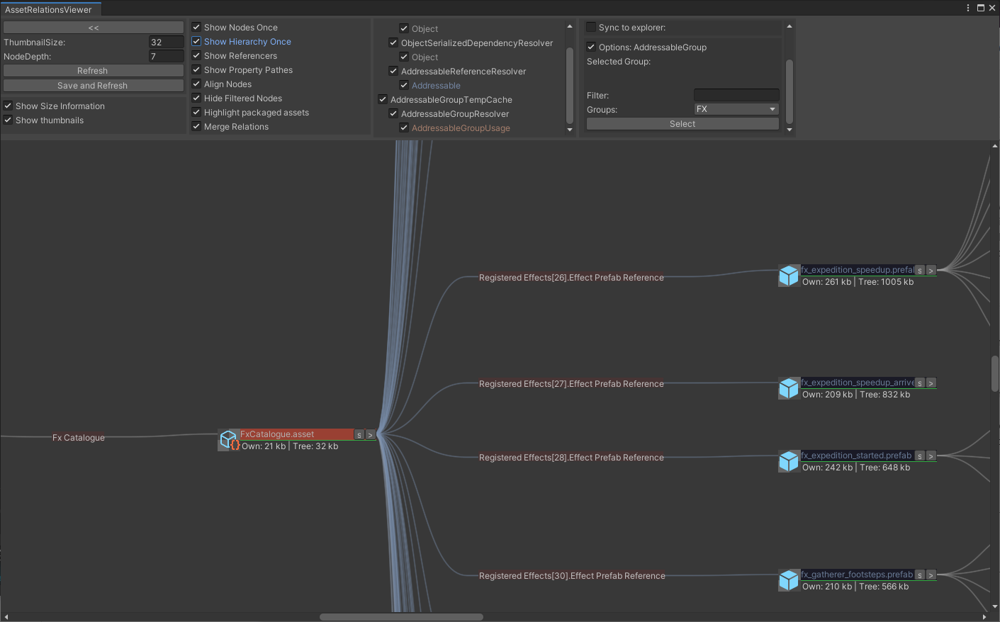

# asset-relations-viewer-addressables

Addon for AssetRelationsViewer to support the unity addressable system.

Tested with addressables version 1.2.2 and up.
Not compatible with verified version 1.1.x!

## Package dependencies

* com.innogames.asset-relations-viewer
* com.unity.addressables

## Installation

#### For Unity 2018.3 or later (Using Unity Package Manager)

Find the manifest.json file in the packages folder of your project and edit it to look like this:
```js
{
  "dependencies": {
    "com.innogames.asset-relations-viewer-addressables": "https://github.com/innogames/asset-relations-viewer-addressables.git",
    ...
  },
}
```

If you are in production and not want to get automatic updates always use a tagged version like:

```js
	...
    "com.innogames.asset-relations-viewer-addressables": "https://github.com/innogames/asset-relations-viewer-addressables.git#1.2.0",
    ...

```

## AddressableAssetGroup

Addressable asset groups and their containing assets can be viewed.
To view dependencies between addressable asset groups and assets the AddressableGroupTempCache/AddressableGroupResolver/AddressableGroupUsage needs to be activated in the cache/resolver list.



#### Limitations

Currently only displays groups in the default settings group.

<br><br><br><br>
## AssetReferences

Assets referenced by an AssetReference can be viewed.
To view assets referenced by an AssetReference the AssetDependencyCache/AddressableReferenceResolver/Addressable needs to be activated in the cache/resolver list.



<br><br><br><br>


