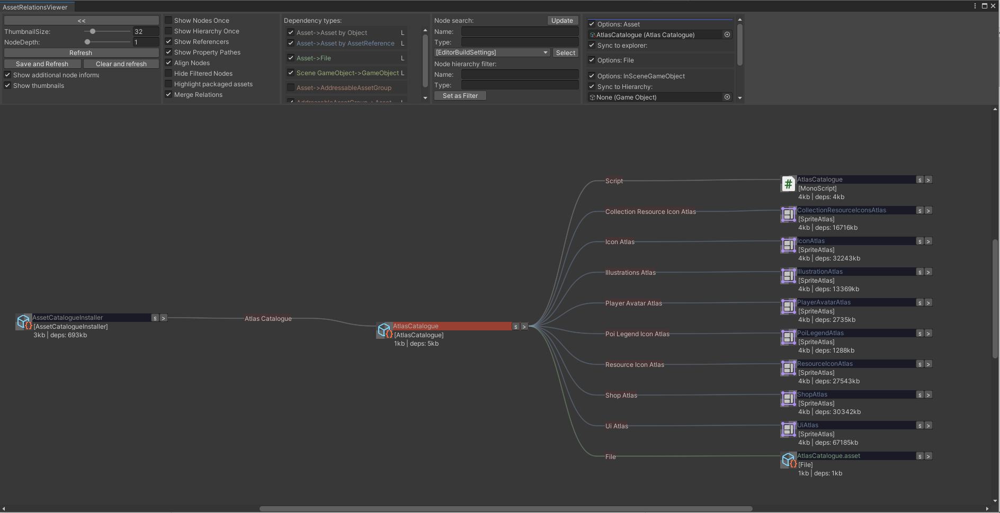
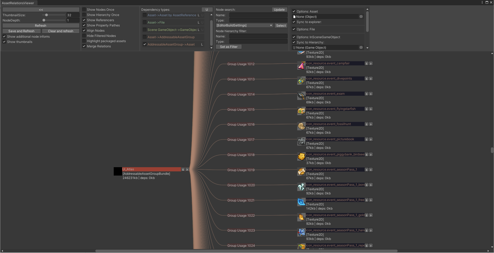
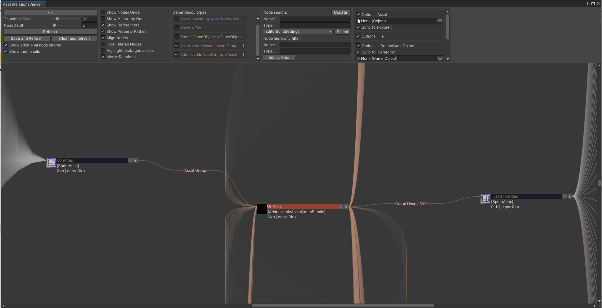
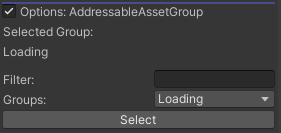

# asset-relations-viewer-addressables

Addon for AssetRelationsViewer to support the unity addressable system.

Tested with addressables version 1.2.2 and up.
Not compatible with verified version 1.1.x!

## Package dependencies

* com.innogames.asset-relations-viewer
* com.unity.addressables

## Installation

#### For Unity 2018.3 or later (Using Unity Package Manager)

Find the manifest.json file in the packages folder of your project and edit it to look like this:
```js
{
  "dependencies": {
    "com.innogames.asset-relations-viewer-addressables": "https://github.com/innogames/asset-relations-viewer-addressables.git",
    ...
  },
}
```

If you are in production and not want to get automatic updates always use a tagged version like:

```js
	...
    "com.innogames.asset-relations-viewer-addressables": "https://github.com/innogames/asset-relations-viewer-addressables.git#1.4.2",
    ...

```

## Dependency types
With the Addressables addon three new dependency types are added.

### Asset->Asset by AssetReference

In addressables a different Object can be referenced by a so called AssetReference instead of UnityEngine.Object <br/>
To display these references this node type needs to be enabled. <br/>



<br><br><br><br>

### AddressableAssetGroup->Asset

AddressableAssetGroups of the Addressable system contain a list of assets. <br/>
By enabling this dependency type these assets can be viewed as a dependency. <br/>



### Asset->AddressableAssetGroup

Used to display the dependecy of an asset to the AddressableAssetGroup it is part of. <br/>
This is basically the opposite direction of the <b>AddressableAssetGroup->Asset</b> dependency. <br/>
This can be used to display birectional dependencies between assets and AddressableAssetGroups when also the <b>AddressableAssetGroup->Asset</b> is enabled. <br/>

#### Note
Having both <b>AddressableAssetGroup->Asset</b> and <b>Asset->AddressableAssetGroup</b> enabled at the same time can lead to very large dependency trees if AssetBundles have a lot of dependencies to other AssetBundles. <br/>
Before enabling both the <b>NodeDepth:</b> should be reduced to something like 4. Otherwise generating the tree structure can take very long. 




## Node handlers
The addressables addon adds one new typehandler

### AddressableAssetGroups

Options specific to AddressableAssetGroups. <br/>


**Selected group**: Shows the currently selected AddressableAssetGroup. <br/>
**Filter**: Filters the dropdown for a specific name. <br/>
**Groups**: Dropdown to select one of the know AddressableAssetGroups. <br/>

## Limitations

Currently only displays groups in the default settings group.

<br><br><br><br>


